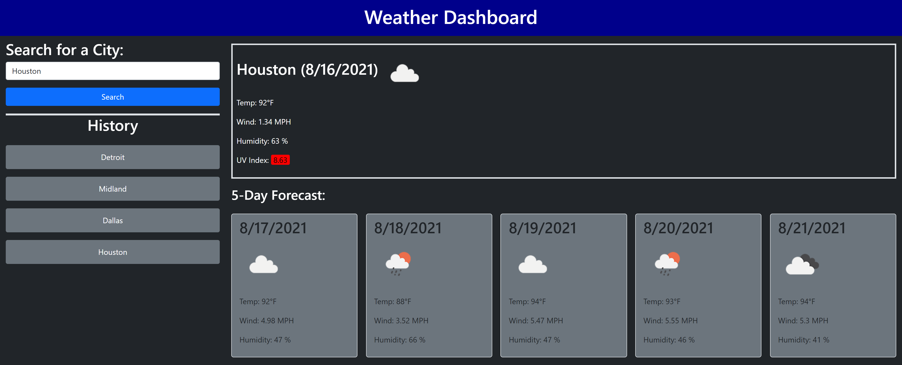

# Server-Side APIs: Weather Dashboard

## Purpose

The Purpose of this project was to create a website that displays weather information and forecast based on a city name input by the user.  

Some features of the site are:
- This site utilizes the OpenWeather API in order to locate the city and retrieve their weather data. Weather icons provided by OpenWeather are also being utilized to represent the current/forecasted conditions. The documentaiton for the APIs/icons used can be found at:
    - Called first to get city coordinates: https://openweathermap.org/forecast5
    - Called second to get current and 5-day forecast conditions: https://openweathermap.org/api/one-call-api
    - Information on the icons used: https://openweathermap.org/weather-conditions#How-to-get-icon-URL
- The 10 most recent searches are saved locally and can be clicked on to bring up their respective weather information.  
- There are validations to ensure that the user is putting in a valid city name and alerts to inform them if they did not.  
- Repeat entries are not saved to the history to avoid clutter. 

The site can be found at: https://jpolmon.github.io/WeatherHW06/

---
## Appearance

### Here is an example of the site with some cities in the search history:  

